> **Applicazioni per Dispositivi Mobili**
>
> **A.A. 2021/2022**

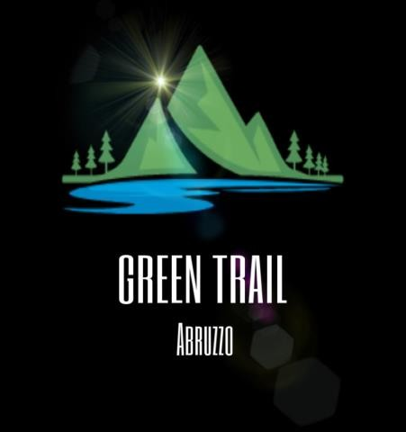{width="2.255028433945757in" height="2.4in"}

Green Trail

> **Design documentation**

+----------------------+---------------------+------------------------+
| **Team Members**     |                     |                        |
+:====================:+=====================+========================+
| > **Name**           | > **Student         | > **E-mail address**   |
|                      | > Number**          |                        |
+----------------------+---------------------+------------------------+
| Luca Visconti        | *266939*            | [*luca.visc            |
|                      |                     | onti2@student.univaq.i |
|                      |                     | t*](mailto:luca.viscon |
|                      |                     | ti2@student.univaq.it) |
+----------------------+---------------------+------------------------+
| Luigi Iaconi         | *260811*            | [*luigi                |
|                      |                     | .iaconi@student.univaq |
|                      |                     | .it*](mailto:luigi.iac |
|                      |                     | oni@student.univaq.it) |
+----------------------+---------------------+------------------------+

# 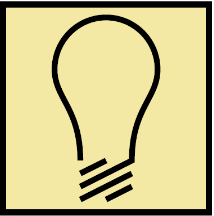{width="1.0719258530183726in" height="1.0838702974628172in"}Strategy

## Product Objectives

### Business goals

> Green Trail intende offrire all'utente uno strumento completo ed
> affidabile per la pianificazione e navigazione per attività outdoor.
>
> Permette di cercare itinerari specifici in base al tipo di attività
> che si intende svolgere: trekking, MTB, kayaking, pesca, passeggiate e
> visite a punti di interesse o ristoro.
>
> È possibile tenere traccia dei percorsi programmati e di quelli
> completati, rilasciando volontariamente feedback utili per la
> community.
>
> L'app è ideata sia per sportivi che per famiglie, grazie alla
> classificazione per attività e difficoltà oltre alle preziose
> informazioni inserite nei risultati di ricerca è infatti possibile
> programmare uscite senza brutte sorprese.

### Product Overview

> Green Trail è una app che consente agli utenti di scoprire nuovi posti
> e fare esperienze indimenticabili in Abruzzo, fornendo un potente
> strumento di ricerca e pianificazione dei percorsi, nonché
> un'affidabile risorsa per avventurieri e amanti della nostra regione.
>
> L'obiettivo di Green Trail è offrire a utenti di qualsiasi età e
> preparazione di poter scoprire luoghi e panorami nella nostra terra,
> cercando di stimolare l'interesse per l'attività fisica e dunque il
> turismo sostenibile.

### Competitors

#### Komoot

> L'app consente di creare percorsi a seconda dello sport preferito,
> includendo informazioni relative a superfici, livello di difficoltà,
> distanza e dislivello.
>
> È possibile scaricare i percorsi in modo da consultare le mappe anche
> in assenza di connessione alla rete.
>
> Nella sezione Highlight gli utenti possono condividere le loro
> avventure, con foto e suggerimenti, o ispirarsi a quelle delle altre
> persone per programmare la prossima uscita.

#### AllTrails

> AllTrails consente di pianificare uscite, scegliendo percorsi pedonali
> adatti ai cani, ai bambini ai portatori di handicap.
>
> Sono presenti oltre 200.000 sentieri in tutto il mondo per
> escursionismo, MTB e corsa- L'app permette di condividere i feedback
> con gli altri utenti.
>
> Le mappe possono essere salvate nei preferiti e utilizzate offline
> tenendo traccia, in tempo reale, dei propri progressi.
>
> Si possono visualizzare le statistiche e condividere le proprie
> attività su altri social. Salva i tuoi percorsi preferiti
>
> L'app consente di inserire nuovi percorsi, previa approvazione.
>
> Stai al sicuro con Lifeline: assegna contatti per la sicurezza che
> conoscono il tuo piano e possono monitorare i tuoi progressi
>
> Sono presenti features come la personalizzazione delle mappe, le
> condizioni meteo, inquinamento luminoso e pollini.

#### I Sentieri del Centro Abruzzo

> L\' app mette a disposizione dell'utente un archivio di tracce GPS ove
> sono raccolti in oltre 1.300 Km di sentieri in formato gpx.
>
> Le tracce disponibili sono relative ai sentieri del Monte Genzana,
> della Valle del Sagittario, del Parco Nazionale Abruzzo Lazio e Molise
> e del Parco Nazionale della Majella.
>
> Tuttavia, è richiesta l'apertura delle tracce GPS con un'app di
> navigazione esterna.
>
> Numerose app simili alle prime due sopra menzionate, spesso con
> interfacce poco intuitive. Risulta inoltre difficile trovare, in
> un'unica app, tutte le funzionalità che Green Trail si pone di
> implementare.

## User Needs

### Needs & goals

> L'utente necessita di un'applicazione precisa e affidabile.
> L'interfaccia deve essere intuitiva e ben visibile all'aperto. È
> importante permettere di scaricare le mappe, poiché non è affatto
> improbabile che la connessione ad Internet sia debole o assente
> durante l'attività. La categorizzazione, la difficoltà e altre
> informazioni relative ai risultati di ricerca, come gli orari di
> apertura dei punti di interesse, dovrebbero essere il più dettagliati
> ed aggiornati possibili per consentire una corretta pianificazione,
> evitando spiacevoli sorprese. È utile salvare i risultati di ricerca
> per poterli consultare in seguito. È necessario conoscere, per quanto
> possibile, lo stato dei sentieri. Per garantire la sicurezza di chi
> percorre un sentiero, il percorso iniziato dall'utente, ed
> eventualmente la sua ultima posizione dovrebbero essere informazioni
> immediatamente recuperabili in caso emergenza.
>
> Green Trail, per quanto possibile, utilizza un contrasto elevato, per
> garantire una buona visibilità anche nelle condizioni più estreme.
>
> La ricerca è suddivisa per: sport (trekking, MTB, kayaking, pesca),
> punti di interesse (come monumenti, eremi) e di ristoro, oltre ad aree
> attrezzate al campeggio / rifugi.
>
> Nei risultati correlati all' attività sportiva, è possibile consultare
> informazioni quali difficoltà del percorso, lunghezza, punti di
> interesse nelle vicinanze, feedback di altri utenti.
>
> È possibile segnalare problemi come bug dell'app, informazioni
> rilevanti (es. sentiero interrotto), consigliare nuovi percorsi o
> punti di interesse.
>
> I risultati di ricerca possono essere salvati in un'apposita
> categoria, che permetterà all'usufruitore di recuperarli in maniera
> tempestiva. È possibile salvare la mappa prima di iniziare il percorso
> ma, all'avvio, se non è già scaricata, sarà salvata automaticamente.
> Si offre all'utente un sistema di tracking live dei progressi sul
> percorso, dunque, anche in assenza di connessione di rete, grazie alla
> posizione rilevata tramite GPS (anche se con minor precisione) sarà
> possibile orientarsi e monitorare la situazione. Quando un utente
> inizia un percorso, il sistema di backup della sua posizione viene
> avviato, consentendo di recuperare in maniera approssimativa la sua
> ultima posizione registrata.
>
> La funzionalità di SOS, a percorso avviato, permette di chiamare
> rapidamente i soccorsi.

### User Research

> L'obiettivo principale di GreenTrail è consentire agli utenti di
> scoprire luoghi immersi nella natura abruzzese.

- Quante volte hai rinunciato ad un\'escursione in montagna perché non
  ti sentivi pronto? GreenTrail ti aiuta a cercare il sentiero più
  adatto, con mappe utilizzabili anche offline. Puoi selezionarne uno
  dai percorsi consigliati o cercare quello più adatto grazie agli utili
  filtri di ricerca.

- Quanto tempo hai speso per cercare, senza successo, un ristorante con
  panorama mozzafiato?

> Le recensioni sul web potrebbero non essere sufficienti. Per vivere
> un'esperienza nuova e lasciare sbalorditi i tuoi amici e la tua
> famiglia, la ricerca per punti di interesse mostra rapidamente i punti
> di ristoro situati nelle location più affascinanti ed avvolgenti.
>
> La durata della sessione media sarà di qualche minuto in caso di
> pianificazione di viaggio, mentre fino a diverse ore in caso di avvio
> del percorso.
>
> L'app può essere utilizzata sia da sportivi che da famiglie, ergo non
> ha un target specifico. È chiaro che gli appassionati di trekking o
> MTB utilizzando per un tempo medio maggiore l'app, non tanto per la
> pianificazione quanto per la funzionalità "Avvia percorso".

### Personas

#### Lorenzo

> Età: 21 - Occupazione: Studente fuorisede -- Stato sociale: Single Uso
> del Web: piattaforme di streaming, videogiochi - Profilo tecnico:
> internauta esperto, Poco X3
>
> Lorenzo è uno studente di 21 anni dell'Università dell'Aquila.
> Condivide il suo appartamento a Pettino con un altro coinquilino
> nonché amico di lunga data. Ama la natura e le uscite in mountain
> bike, specialmente in gruppo. Dispone di un\'auto con portabici e non
> ha problemi a raggiungere le zone più impervie.

#### Mia

> Età: 52 - Occupazione: Segretaria -- Stato sociale: Sposata, 1 figlio
> Uso del Web: Facebook, Zoom - Profilo tecnico: conoscenza limitata ai
> tools con i quali lavora, Samsung S21
>
> Mia lavora presso gli uffici di una nota azienda di vini nel chietino.
> È sposata da 15 anni ed è madre di un figlio di 8 anni. Vive a
> Montelapiano, piccolo borgo facente parte dei comuni montani del
> Sangro.

#### Riccardo

> Età: 25 - Occupazione: Dipendente -- Stato sociale: Fidanzato Uso del
> Web: notizie, video, Instagram - Profilo tecnico: poco pratico con la
> tecnologia, Xiaomi MI9
>
> Studente di agraria presso l'Università Politecnica delle Marche,
> escursionista esperto. Possiede una casa a Villa Santa Lucia degli
> Abruzzi ed ama fare uscite verso i luoghi più irraggiungibili, anche
> in solitaria.

# {width="1.0840277777777778in" height="1.078471128608924in"}Scope

### Features

#### Main features:

- Ricerca filtrata per sport e difficoltà: trekking, MTB, kayaking,
  pesca

- Ricerca filtrata per punti di interesse: eremi, ristoranti immersi
  nella natura o vicini a borghi, monumenti

- Ricerca per aree attrezzate al campeggio Consigliati, ovvero i
  percorsi per trekking e MTB, non ancora completati, più affini al
  point score dell'utente

- Condivisione di feedback, basati sull'esperienza vissuta

- Strumento di segnalazione: comunicazioni, rivolte ai gestori dell'app,
  come bug dell'applicazione, stato dei percorsi, consigli

- Navigazione mappe trekking e MTB tramite "Avvia percorso", anche in
  assenza di connessione

- I miei percorsi, ossia la lista dei percorsi avviati

- Possibilità di salvare i risultati di ricerca per consultarli in
  seguito nella sezione Luoghi salvati

#### Rules and constraints:

- Facilmente navigabile, grazie alla sidebar minimale

- La ricerca per punti di interesse, ristoro o campeggio è limitata ai
  risultati, senza assistente di navigazione per raggiungerli (è
  necessario utilizzare un'applicazione esterna come Google Maps)

- Le mappe, se non sono già state scaricate, si salvano sul dispositivo
  non appena si avvia il percorso

### Other requirements

> Provide [a list]{.underline} of other requirements (not implicitly
> included in the features) of your app (for instance, branding
> requirements, technical requirements, ...)

- Registrazione con inserimento di dati personali e compilazione
  obbligatoria di un questionario relativo agli interessi e
  all'esperienza dell'utente

- Autenticazione tramite social / Google

- Point score**:** per ogni percorso completato dall'utente, si assegna
  un punteggio e il totale viene confrontato con la difficoltà dei
  sentieri. Ogni sentiero è collocato in una fascia, ovvero un range di
  punti di esperienza che si dovrebbero avere.

> All'utente, in base al suo punteggio esperienza, affianco alla
> difficoltà del sentiero appare un pallino che può avere 3 colori:
> rosso, se la fascia di punti esperienza attribuita
>
> dall'applicazione al percorso è di molto minore a quella raggiunta
> dall'utente, gialla se è di poco inferiore, verde se è pari o
> maggiore.

- I risultati di ricerca relativi a trekking e MTB includono la
  possibilità di avviare il percorso. Ciò non è possibile con gli altri
  risultati di ricerca. Tuttavia, è sempre visibile una mappa che indica
  la posizione da raggiungere.

- Possibilità di consultare le mappe scaricate nella sezione Mappa
  salvate

- Tasto SOS, disponibile a percorso avviato. Consente di chiamare
  rapidamente i soccorsi.

- Se l'utente non ha mai fatto l'accesso, è richiesto di compilare un
  questionario.

### Scenarios

> **Scenario 1:** Lorenzo vorrebbe pianificare un'uscita in MTB con un
> suo caro amico, in un posto dove non sono mai stati.
>
> Per farlo, avvia l'applicazione e cerca con i filtri "MTB" e
> difficoltà "Intermedia", senza specificare alcun luogo.
>
> Dopo un'attenta analisi, sceglie un percorso e scarica la mappa.
>
> Arrivati in loco, dall'app preme il tasto "Avvia percorso" e iniziano
> a pedalare. I due amici sono pronti per vivere una giornata
> indimenticabile.

#### Scenario 2:

> Mia vorrebbe visitare un paese nel quale non è mai stata, e ricordando
> il nome di San Demetrio ne' Vestini, consigliatole da un collega
> aquilano, fa una ricerca per punti di interesse.
>
> Scopre che è possibile visitare le magnifiche Grotte di Stiffe e a
> pochi minuti di auto gustare un delizioso pranzo a base di prodotti
> tipici a km zero.

#### Scenario 3:

> Riccardo ha avviato il percorso di trekking dall'applicazione ma,
> durante la sua escursione, nota che il sentiero si interrompe a causa
> di una frana.
>
> Non essendo possibile proseguire, è costretto a tornare indietro.
>
> Essendo un'informazione di primaria importanza ed estremamente utile
> per la community, l'escursionista decide di inviare una segnalazione
> tramite l'apposita sezione.
>
> In tal modo, il reparto dedicato si occuperà di gestire e verificare
> la segnalazione, inserendo in seguito un apposito avviso nei dettagli
> del percorso in questione.

# 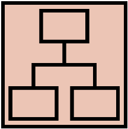{width="1.0833333333333333in" height="1.0888877952755907in"}Structure

### Navigation model

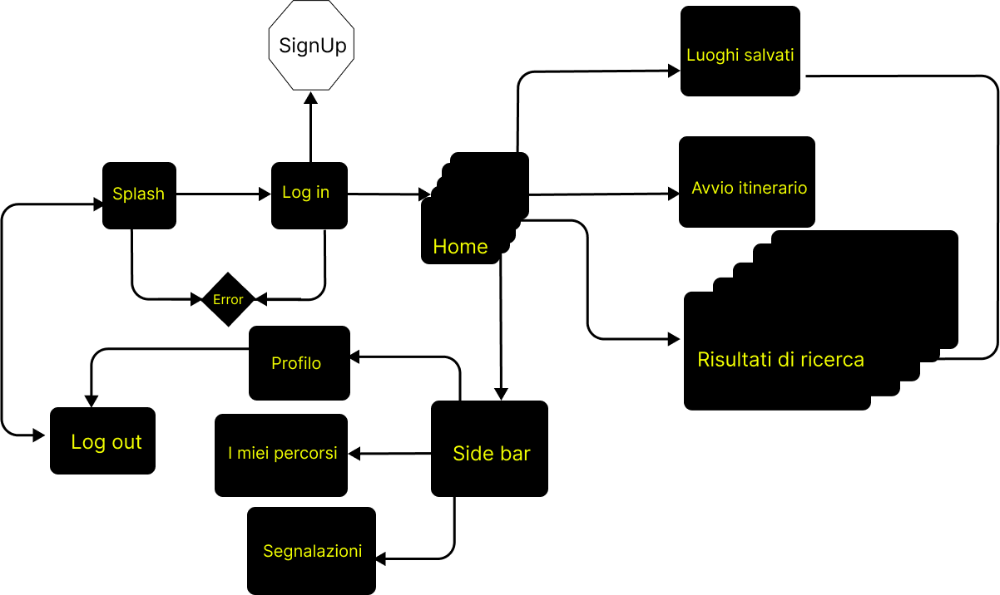{width="5.893201006124235in"
height="3.5054166666666666in"}

> **Splash Screen:** è la vista all'apertura di Green Trail.
>
> **Login:** è la vista che permette all'utente di autenticarsi,
> passaggio obbligatorio per poter utilizzare i servizi offerti
> dall'applicazione.
>
> **Home:** è la vista principale, ove è possibile consultare i
> risultati di ricerca consigliati.
>
> Si tratta di risultati proposti dall'app, mirati a coinvolgere
> l'utente, analizzando il point score e le ultime ricerche.
>
> **Sidebar:** consente all'utente di navigare, in modo agevole, tra le
> differenti sezioni.
>
> **Ricerca:** è la vista più importante, poiché permette di cercare
> utilizzando diversi filtri. Premendo su uno dei risultati, l'utente
> potrà consultare preziosi dettagli oltre a feedback della community.
>
> **Luoghi salvati:** è la vista dove è presente l'elenco dei risultati
> di ricerca salvati dall'utente, così da consultarli rapidamente in un
> secondo momento.
>
> **Mappe salvate:** vista con le mappe scaricate e dunque navigabili
> anche offline.
>
> **Avvia percorso:** la vista è raggiungibile soltanto dai risultati di
> ricerca relativi a itinerari trekking e MTB.
>
> **Profilo:** qui l'utente può gestire i suoi dati personali.
>
> **I miei percorsi:** è la vista contenente la lista dei percorsi
> avviati dall'utente.
>
> **Segnalazioni:** da questa vista l'utente può compilare un form di
> segnalazione, riguardante bug dell'app, stato dei percorsi e consigli.

### Data model

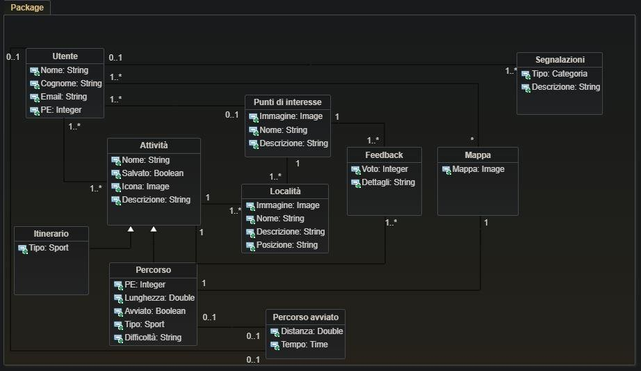{width="7.020609142607174in"
height="4.330624453193351in"}

#### Utente:

> L'entità Utente rappresenta l'utente con le informazioni principali.

#### Attività:

> È l'entità padre che contiene le informazioni principali del risultato
> di ricerca relativo all'attività sportiva selezionata: nome, icona
> dell'attività, descrizione.

#### Itinerario:

> Entità figlia di attività, contiene le tipologie di attività "kayak" e
> "pesca".

#### Percorso:

> Entità figlia di attività, contiene le tipologie di attività
> "trekking" e "MTB", oltre ai seguenti dettagli: Punti Esperienza che
> si riceveranno completando il percorso, la lunghezza, la difficoltà.

#### Località:

> Entità che rappresenta il luogo ove si trova il risultato di ricerca.
> Contiene immagine, nome, descrizione e posizione.

#### Punti di interesse:

> Entità relativa ai risultati di ricerca per punti di interesse /
> campeggio. Contiene immagine, nome e descrizione.

#### Feedback:

> È l'entità che contiene la valutazione e i dettagli del feedback,
> facoltativo, rilasciato dall'utente.

#### Mappa:

> È l'entità che contiene le mappe scaricate.

#### Segnalazioni:

> Entità contente il form di segnalazione, con categoria e descrizione,
> che l'utente può inviare ad un operatore.

# 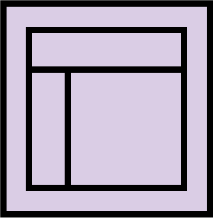{width="1.0682863079615048in" height="1.0941283902012249in"}Skeleton

> Immagine ad alta risoluzione nell'allegato Skeleton.

#### 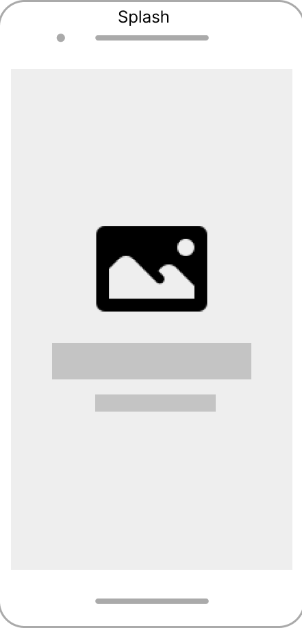{width="1.8444444444444446in" height="3.841463254593176in"}Splash Screen:

> Nello splash screen mostriamo il logo e il nome dell\'applicazione,
> con la regione supportata, per alcuni istanti prima di essere
> reindirizzati alla schermata di login.

#### 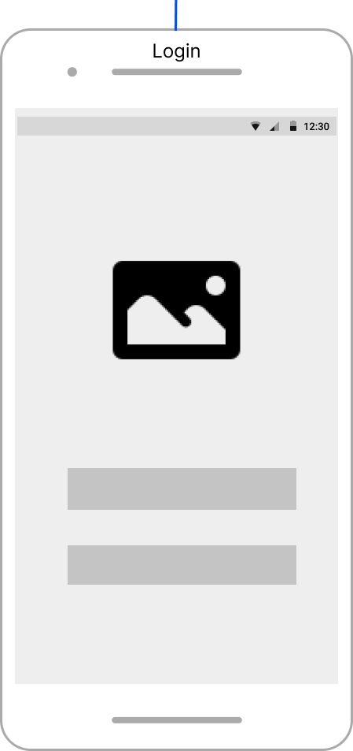{width="1.8806966316710412in" height="3.9978182414698162in"}Login:

> Se la sessione è ancora attiva, questa vista reindirizza
> automaticamente alla Home.
>
> L'accesso è consentito soltanto tramite Google e Facebook.
>
> Se il login avrà successo, si verrà indirizzati alla schermata Home:
> se si tratta del primo accesso nell\'app, si verrà reindirizzati alla
> schermata di Sign Up contente un questionario da compilare.
>
> Sopra i pulsanti di accesso è presente il logo.
>
> Eventuali errori di accesso e necessità di recupero password, saranno
> gestiti nelle apposite interfacce esterne di Google e Facebook.

#### 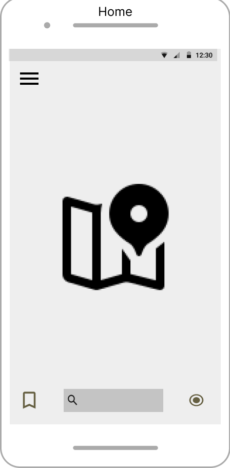{width="1.8254593175853018in" height="3.710236220472441in"}Home:

> La vista Home è composta dalla mappa regionale indicante percorsi,
> itinerari e punti di interesse affini all'utente.
>
> I risultati sono indicati come punti cliccabili sulla mappa (map
> marker), ossia che al tap si espandono mostrando i dettagli del
> singolo risultato di ricerca. Nella vista notiamo:

- in basso a sinistra, l\'icona che rimanda alla schermata Luoghi
  salvati

- in basso al centro, la barra di ricerca che al tap apre la vista
  Ricerca

- in basso a destra, il tasto per ottenere la posizione GPS corrente

> Per rappresentare la mappa, abbiamo scelto di implementare il
> principio di design di area infinita.
>
> In tal modo, l\'utente può scorrere tutta la mappa anche se nello
> schermo è rappresentata soltanto una porzione di essa.

#### 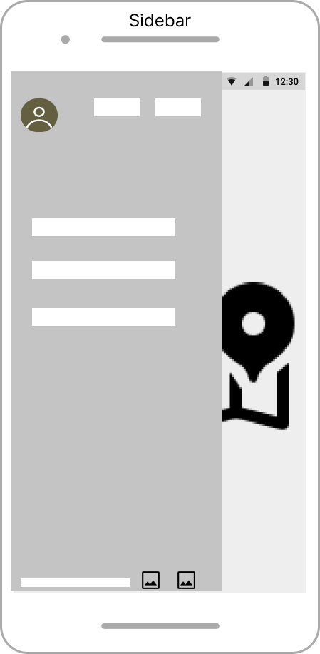{width="1.8851290463692039in" height="3.846195319335083in"}Sidebar:

> È la vista che appare premendo in alto a sinistra nelle schermate di
> Home, Ricerca e Risultati di ricerca.
>
> Consente di consultare rapidamente le varie sezioni, a sinistra dello
> schermo.
>
> In alto è mostrato il contatore dei punti esperienza e chilometri
> totali percorsi, a destra dell'icona che al tap porta alla schermata
> di Profilo. In basso troviamo:

- un collegamento ipertestuale alla Privacy Policy e ai ToS

- due icone per cambiare la ling

#### 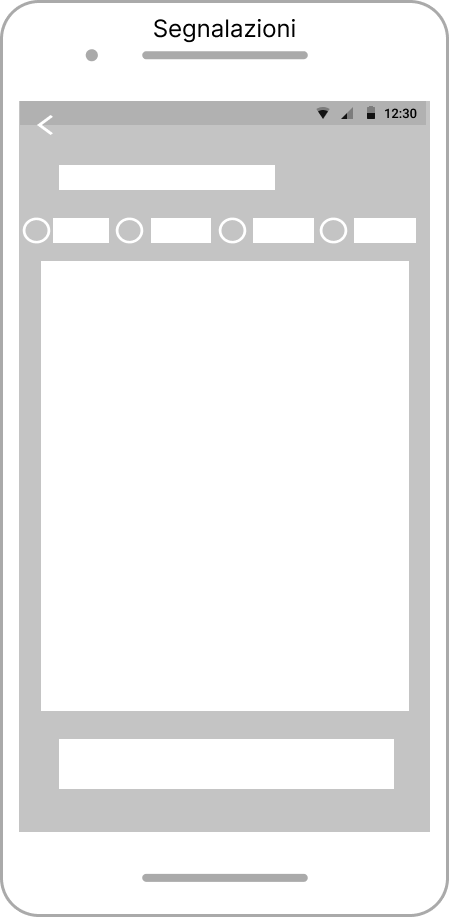{width="1.7566601049868766in" height="3.594582239720035in"}Segnalazioni:

> La vista segnalazioni è raggiungibile dalla Sidebar e contiene la
> selezione della categoria, premendo su una delle quattro opzioni, ed
> una text area per fornire obbligatoriamente i dettagli.
>
> In basso, è presente il bottone di invio segnalazione che permette
> all\'utente di inviare la segnalazione.
>
> Tramite questa vista, è possibile segnalare bug, avvisi e consigli.

#### 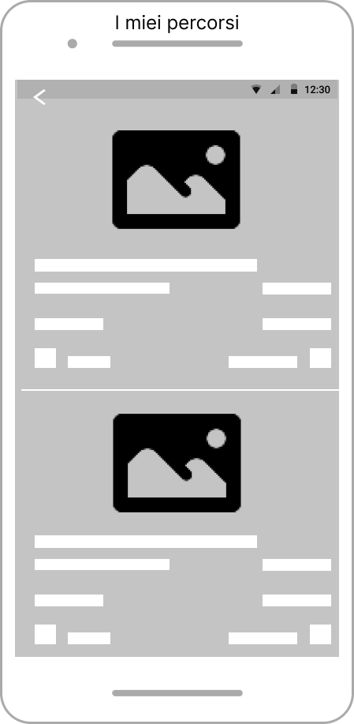{width="1.7417596237970254in" height="3.5564238845144356in"}I miei percorsi:

> La vista "I miei percorsi" è raggiungibile premendo sul medesimo nome
> indicato nella Sidebar.
>
> In alto a sinistra è presente l\'icona per tornare alla Home. Per
> questa vista, abbiamo utilizzato il principio di design di
> **(AIRBNB)**.
>
> Nella prima parte è mostrata la foto del percorso, in basso ...
> L\'utente può scrollare la lista per consultarla integralmente
> (principio di design degli assi infiniti).

#### 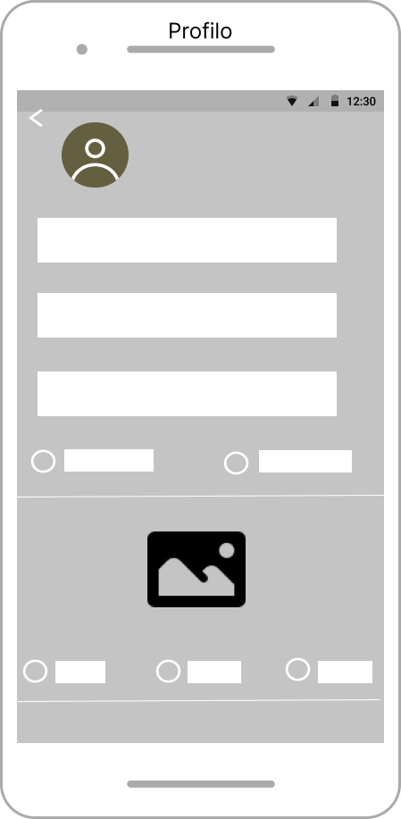{width="2.026735564304462in" height="4.138280839895013in"}Profilo:

> Il profilo è raggiungibile premendo l'icona in alto a sinistra
> all'interno della Sidebar.
>
> In alto sono mostrati nuovamente i contatori dei punti esperienza e
> dei chilometri totali percorsi.
>
> È possibile consultare e modificare le informazioni inserite nel
> questionario in fase di SignUp.
>
> La vista contiene:

- text non editabile del nome e cognome mentre si lascia la possibilità
  di poter cambiare in qualsiasi momento il numero di telefono

- Radio button per la selezione del sesso di appartenenza

- Immagini delle attività da selezionare per la profilazione

- Esclusivamente per trekking e MTB, è possibile selezionare attraverso
  apposito radio button il proprio livello di esperienza

#### 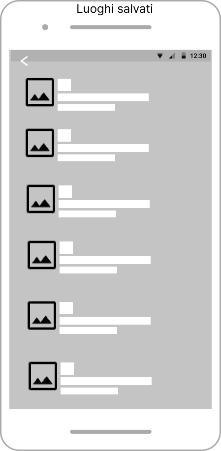{width="1.863423009623797in" height="3.807849956255468in"}Luoghi salvati:

> La vista Luoghi salvati è raggiungibile tramite tap dall\'icona in
> basso a sinistra della Home e dalla Sidebar.

#### Ogni luogo salvato è rappresentato da nome,

> Abbiamo scelto di utilizzare il principio di design degli spazi
> infiniti, per consentire all\'utente di scrollare tra i differenti
> luoghi della lista.

#### 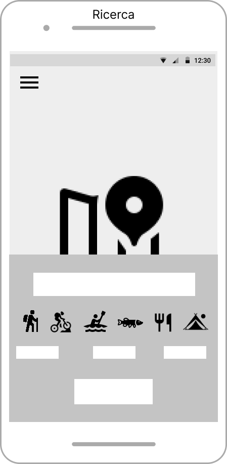{width="1.6831441382327208in" height="3.435745844269466in"}Mappe salvate:

> **Ricerca:**
>
> La vista Ricerca è consultabile premendo sulla barra di ricerca della
> vista Home.
>
> È composta dalla mappa, con principio di design di area infinita,
> assieme ad un\'area sottostante che include la barra di ricerca, le
> icone delle categorie di ricerca e, esclusivamente per trekking e MTB,
> la scelta della difficoltà del percorso.
>
> In basso, al centro, il bottone per avviare la ricerca.
>
> 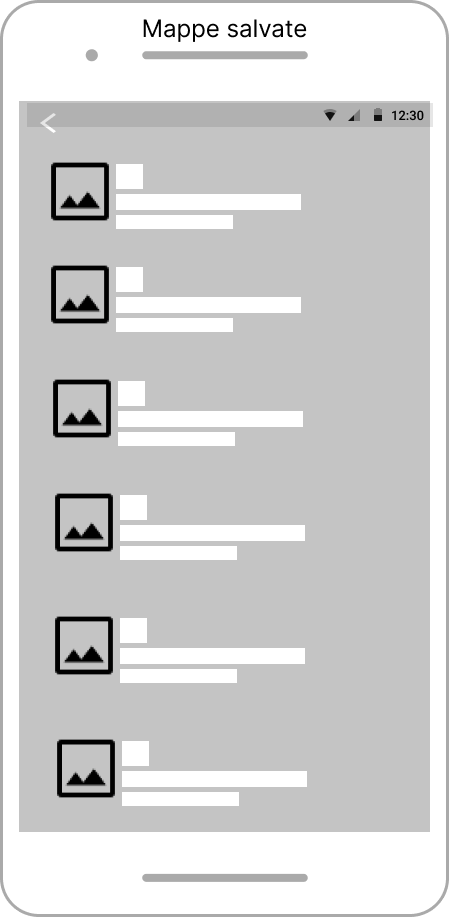{width="1.9368405511811024in"
> height="3.94832239720035in"}La vista Mappe salvate è raggiungibile
> tramite tap dalla Sidebar. **Ciascuna mappa è elencata come risultato
> contenente: foto del percorso, nome, località.**
>
> Abbiamo scelto di implementare il principio di design degli spazi
> infiniti, per consentire all\'utente di scrollare lungo l\'elenco.

#### 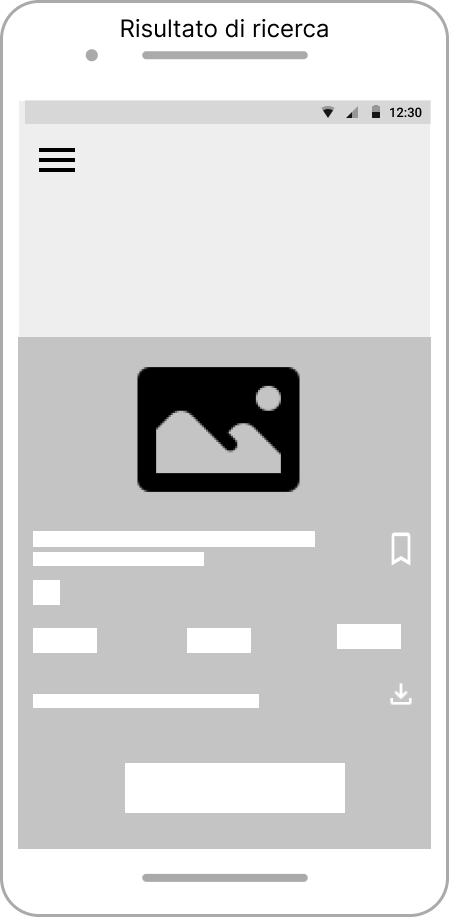{width="1.684773622047244in" height="3.4374431321084864in"}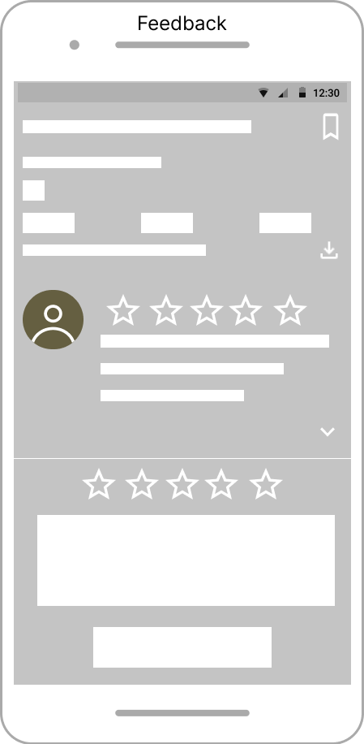{width="1.7220811461067367in" height="3.5092793088363954in"}Risultato di ricerca:

> Risultato di ricerca è una vista raggiungibile premendo su uno dei map
> marker, presenti sulla mappa e dunque dalle viste Home e Ricerca. Si
> tratta di una schermata mostrante i dettagli del risultato selezionato
> ed è costituita da:
>
> immagine, label del nome, label della località, icona della categoria,
> icona per aggiungere alla lista dei Luoghi salvati.
>
> Inoltre, nel caso si tratti di trekking o MTB le seguenti label:
> lunghezza del percorso, difficoltà del percorso, punti esperienza
> assegnabili, punti di esperienza consigliati per affrontarlo.

#### 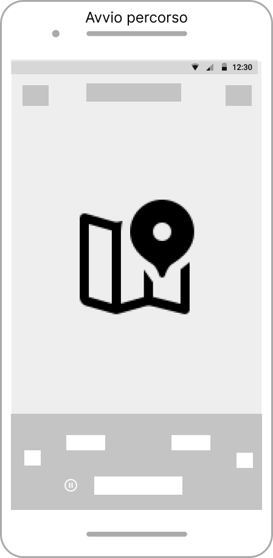{width="1.8977121609798775in" height="3.878553149606299in"}Avvia itinerario:

> La vista Avvio itinerario è raggiungibile tramite tap dall'apposito
> bottone per avviare l'itinerario, esclusivamente dalla vista Risultato
> di ricerca che supporta tale funzionalità (trekking e MTB).
>
> La vista e\` composta dalla mappa, implementata tramite principio di
> design dell\`area infinita, label del contatore della distanza
> percorsa, label della lunghezza totale del percorso, icone per
>
> mettere in pausa o terminare il tracking del percorso

# 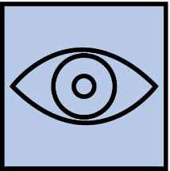{width="1.0733016185476816in" height="1.0838702974628172in"}Surface

> Il bianco, assieme al giallo, su sfondo nero contribuiscono a offrire
> un buon contrasto fondamentale per ambienti con elevata luminosità.
>
> Il colore giallo stimola la volontà e mette di buonumore, facendoci
> sentire più attivi ed energici.
>
> Ci porta quindi all'azione e, da un punto di vista fisico, il giallo
> regolerebbe il battito cardiaco e stimolerebbe un corretto
> funzionamento della pressione arteriosa incrementando le prestazioni
> fisiche.
>
> Il rosso è utilizzato per il tasto \" SOS \", colore associabile ad
> una situazione di emergenza.

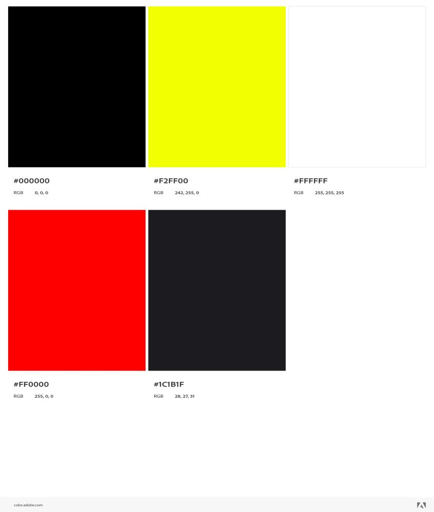{width="4.235696631671041in" height="4.995in"}

> Il carattere scelto è **Open Sans**.È un font semplice con uno stile
> moderno, leggibile anche in piccole dimensioni.
>
> {width="5.0078280839895015in"
> height="2.39875in"}
>
> L' **icona** è stata realizzata combinando le montagne con l'acqua,
> che può rappresentare sia un lago che il mare, dato che le catene
> montuose abruzzesi regalano spesso una suggestiva vista sulla costa
> adriatica, data la distanza contenuta.

{width="2.255028433945757in" height="2.4in"}

> **HiFi Wireframes**
>
> {width="1.7942672790901137in"
> height="3.0547911198600173in"} {width="1.8075590551181102in"
> height="3.0592705599300087in"}
> 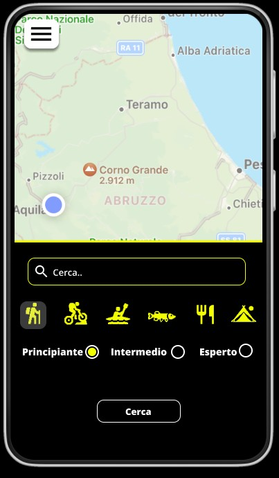{width="1.8088265529308836in"
> height="3.090624453193351in"}
>
> {width="1.7375951443569553in"
> height="2.916978346456693in"} {width="1.7726990376202976in"
> height="2.988124453193351in"}
> 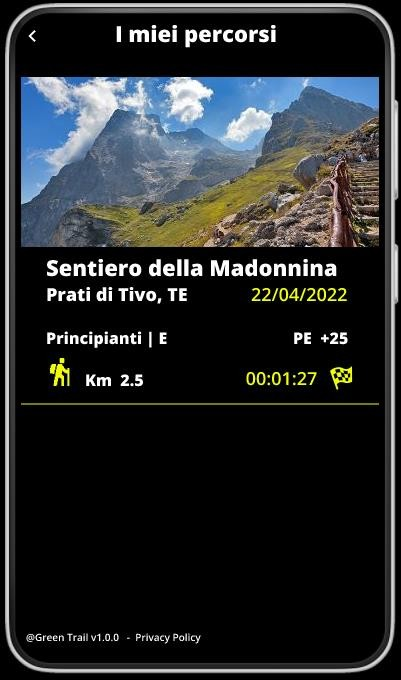{width="1.7093055555555556in"
> height="2.904166666666667in"}
>
> {width="1.8228007436570428in"
> height="3.090624453193351in"}
> 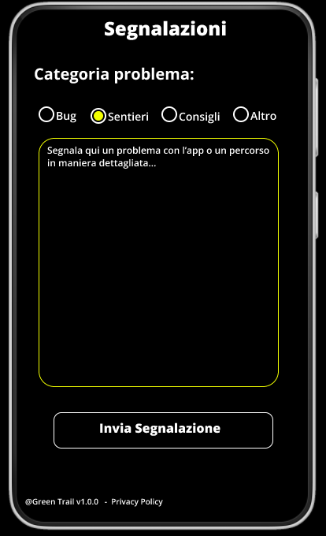{width="1.8092508748906386in" height="2.975in"}
> 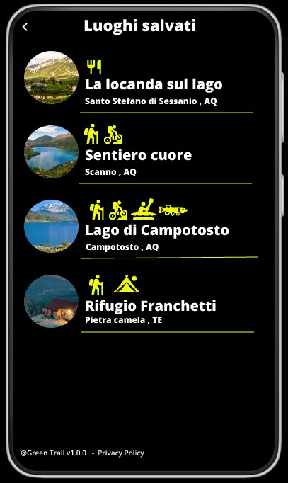{width="1.7809547244094488in"
> height="2.98375in"}
>
> 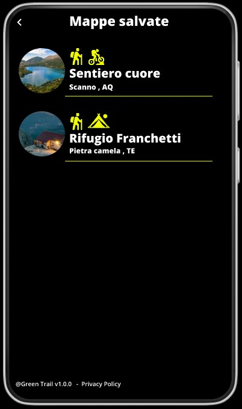{width="1.884595363079615in" height="3.1875in"}
